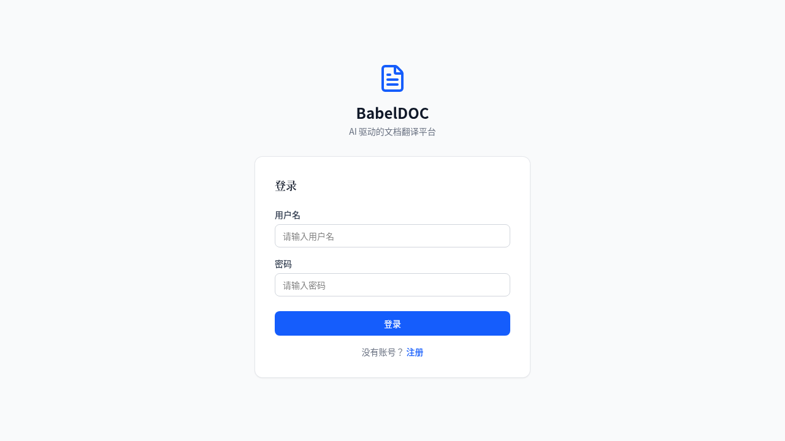
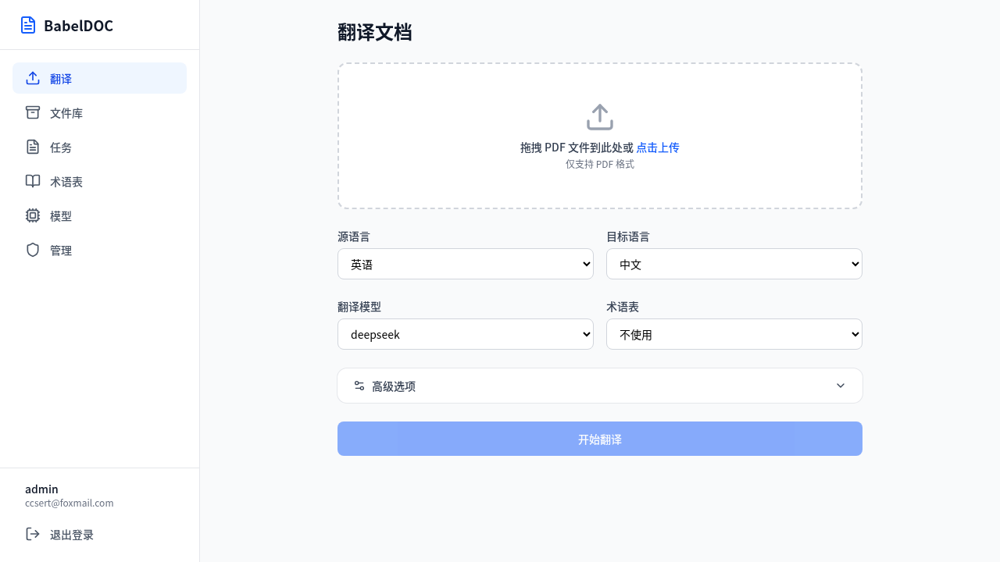
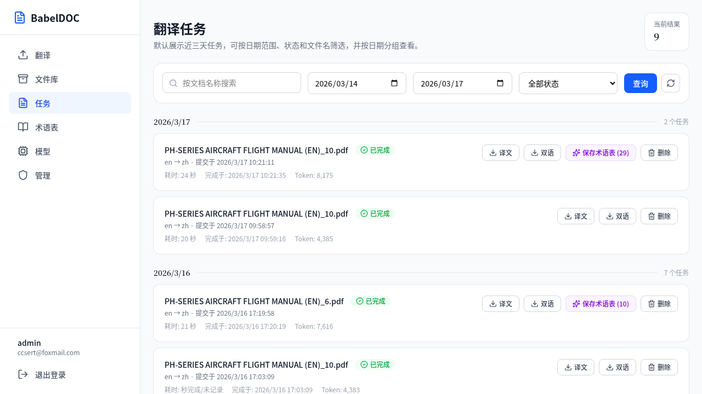
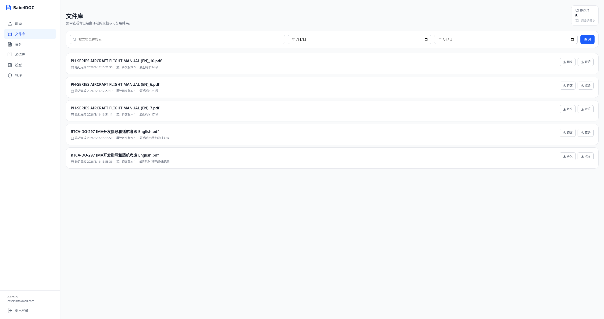
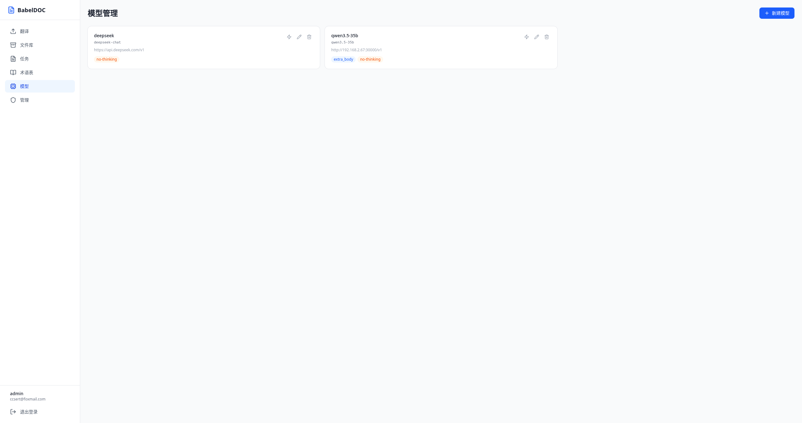
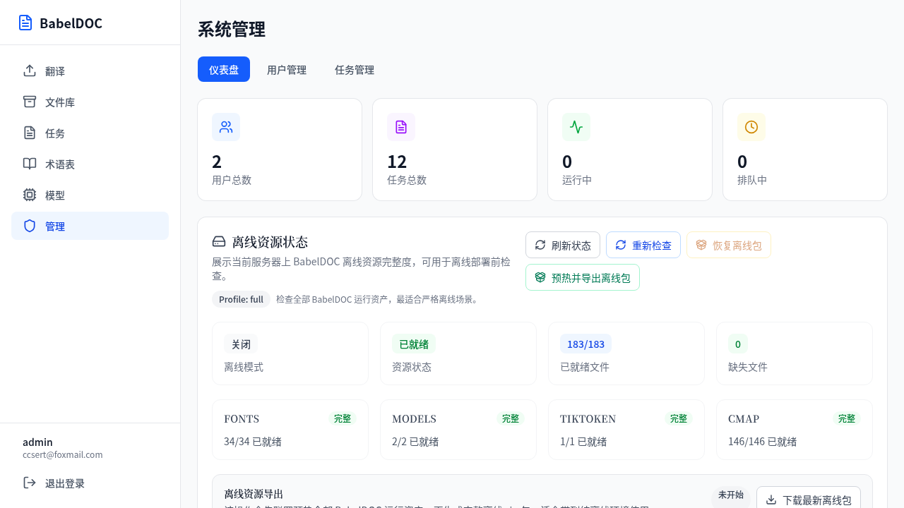

# BabelDOC Web

[English](README.md) | 简体中文

BabelDOC Web 是一个面向 PDF 文档翻译场景的 Web 平台，基于 [BabelDOC](https://github.com/funstory-ai/BabelDOC) 核心引擎构建，提供用户管理、模型配置、任务队列、术语表管理、离线资产运维和管理后台等能力。

## 项目展示

<table>
  <tr>
    <td width="50%" align="center">
      
      <br /><em>登录</em>
    </td>
    <td width="50%" align="center">
      
      <br /><em>翻译</em>
    </td>
  </tr>
  <tr>
    <td width="50%" align="center">
      
      <br /><em>高级选项</em>
    </td>
    <td width="50%" align="center">
      
      <br /><em>任务管理</em>
    </td>
  </tr>
  <tr>
    <td width="50%" align="center">
      
      <br /><em>文件库</em>
    </td>
    <td width="50%" align="center">
      
      <br /><em>术语表</em>
    </td>
  </tr>
  <tr>
    <td width="50%" align="center">
      
      <br /><em>模型配置</em>
    </td>
    <td width="50%" align="center">
      
      <br /><em>管理后台</em>
    </td>
  </tr>
</table>

## 核心能力

- **用户体系** — 注册登录、管理员角色、基础权限隔离
- **翻译任务** — PDF 翻译任务创建、排队、取消、下载和状态跟踪
- **术语表管理** — 维护术语表，支持自动提取术语后直接保存
- **模型配置** — OpenAI 兼容模型配置，支持 `extra_body` 自定义参数透传
- **离线资产** — 离线资源恢复、状态检查、导出和分级预检
- **管理后台** — 系统统计、用户管理和全局任务概览

## 技术栈

| 层级 | 技术 |
|------|------|
| 后端 | FastAPI, SQLAlchemy, PostgreSQL, Alembic |
| 前端 | React, Vite, Tailwind CSS |
| 队列与缓存 | Redis |
| 翻译引擎 | BabelDOC |

## 快速开始

### Docker 部署（推荐）

```bash
wget -O docker-compose.yml https://github.com/ccsert/DocBabel/raw/main/docker-compose.yml
docker compose pull
docker compose up -d
```

拉取 ghcr.io 预构建镜像并启动全部服务，启动后访问 `http://localhost`。

### 本地开发

**1. 启动基础服务（仅 PostgreSQL + Redis）**

```bash
docker compose up -d postgres redis
```

**2. 启动后端**

```bash
cd backend

cp .env.example .env
uv sync
uv run alembic upgrade head
uv run uvicorn app.main:app --reload --host 0.0.0.0 --port 8000
```

**3. 启动前端**

```bash
cd frontend

npm install
npm run dev
```

默认开发地址：前端 `http://localhost:5173`，后端 `http://localhost:8000`。

## Docker 部署

### 在线一键部署（推荐）

无需克隆仓库，仅需下载 Compose 文件，拉取 ghcr.io 预构建镜像即可启动：

```bash
# 仅下载 Compose 文件
wget -O docker-compose.yml https://github.com/ccsert/DocBabel/raw/main/docker-compose.yml

# 拉取镜像并启动全部服务
docker compose pull
docker compose up -d
```

启动后访问 `http://localhost`。

### 源码构建

```bash
git clone https://github.com/ccsert/DocBabel.git
cd DocBabel
docker compose up -d --build
```

将构建并启动全部 4 个服务（PostgreSQL、Redis、后端、前端）。

### 从 GitHub Container Registry 拉取

每次发布 Release 时会自动推送预构建镜像（后端已内置离线资源）：

```bash
docker pull ghcr.io/ccsert/babeldoc-backend:latest
docker pull ghcr.io/ccsert/babeldoc-frontend:latest
```

### 离线安装包

适用于无网络环境，从 [Releases](https://github.com/ccsert/DocBabel/releases) 页面下载离线安装包。包含：

- 全部 Docker 镜像（后端已内置完整离线资源、前端、PostgreSQL、Redis）
- `docker-compose.yml`
- 一键安装脚本

```bash
tar xzf babeldoc-offline-v*.tar.gz -C babeldoc
cd babeldoc
chmod +x install.sh
./install.sh
```

后端镜像已包含全部 BabelDOC 运行资源（模型、字体、CMap、tiktoken 缓存），完全无需额外下载。

## 首次使用

1. 注册第一个账户，系统会自动赋予管理员权限。
2. 在**模型**页面添加至少一个翻译模型配置。
3. 在**翻译**页面上传 PDF 并提交翻译任务。
4. 在**任务**页面跟踪处理进度并下载结果。

## 功能详情

### 翻译工作流

- 上传 PDF，设置源语言、目标语言、模型和术语表。
- 生成双语或单语结果文件。
- 将自动提取的术语保存为长期可复用的术语表。

### 管理后台

- 查看用户总数、任务总数、运行中任务和排队任务。
- 管理用户和全局任务。
- 检查离线资源完整度，执行恢复或导出操作。

### 离线部署

环境变量：

| 变量 | 说明 |
|------|------|
| `BABELDOC_OFFLINE_MODE=true` | 启用离线模式 |
| `BABELDOC_OFFLINE_ASSETS_PACKAGE=/path/to/pkg.zip` | 离线资产包路径 |
| `BABELDOC_PRECHECK_ASSETS_ON_STARTUP=true` | 启动时执行资产预检 |
| `BABELDOC_OFFLINE_ASSET_PROFILE=full\|core\|minimal` | 资产档位 |

档位建议：

| 档位 | 适用场景 |
|------|----------|
| `full` | 严格离线部署环境 |
| `core` | 开发和联调 |
| `minimal` | 仅做最小启动前检查 |

## 项目结构

```
web/
├── backend/
│   ├── app/
│   │   ├── api/          # 认证、任务、术语表、模型、管理员
│   │   ├── core/         # 配置、数据库、依赖注入、安全
│   │   ├── models/       # ORM 模型
│   │   ├── schemas/      # Pydantic 数据模式
│   │   ├── services/     # 队列、翻译 Worker、资产服务
│   │   └── main.py       # FastAPI 入口
│   ├── alembic.ini
│   └── pyproject.toml
├── frontend/
│   ├── src/
│   │   ├── components/
│   │   ├── pages/
│   │   ├── api.ts
│   │   ├── auth.tsx
│   │   └── App.tsx
│   └── package.json
├── docs/
├── docker-compose.yml
├── LICENSE
└── README.md
```

## 接口一览

### 认证

| 方法 | 接口 | 说明 |
|------|------|------|
| POST | `/api/auth/register` | 用户注册 |
| POST | `/api/auth/login` | 用户登录 |
| GET | `/api/auth/me` | 获取当前用户信息 |

### 任务

| 方法 | 接口 | 说明 |
|------|------|------|
| POST | `/api/tasks` | 创建翻译任务 |
| GET | `/api/tasks` | 获取任务列表 |
| GET | `/api/tasks/{id}` | 获取任务详情 |
| POST | `/api/tasks/{id}/cancel` | 取消任务 |
| GET | `/api/tasks/{id}/download/{mono\|dual}` | 下载翻译结果 |
| POST | `/api/tasks/{id}/save-glossary` | 保存提取的术语表 |

### 术语表

| 方法 | 接口 | 说明 |
|------|------|------|
| GET | `/api/glossaries` | 获取术语表列表 |
| POST | `/api/glossaries` | 创建术语表 |
| PATCH | `/api/glossaries/{id}` | 更新术语表 |
| DELETE | `/api/glossaries/{id}` | 删除术语表 |
| POST | `/api/glossaries/{id}/entries` | 添加术语条目 |
| DELETE | `/api/glossaries/{id}/entries/{entry_id}` | 删除术语条目 |

### 模型

| 方法 | 接口 | 说明 |
|------|------|------|
| GET | `/api/models` | 获取模型列表 |
| POST | `/api/models` | 创建模型 |
| PATCH | `/api/models/{id}` | 更新模型 |
| DELETE | `/api/models/{id}` | 删除模型 |

### 管理员

| 方法 | 接口 | 说明 |
|------|------|------|
| GET | `/api/admin/stats` | 系统统计 |
| GET | `/api/admin/users` | 用户列表 |
| PATCH | `/api/admin/users/{id}` | 更新用户 |
| DELETE | `/api/admin/users/{id}` | 删除用户 |
| GET | `/api/admin/tasks` | 全局任务列表 |
| POST | `/api/admin/tasks/{id}/cancel` | 取消任意任务 |
| GET | `/api/admin/offline-assets/status` | 资产状态 |
| POST | `/api/admin/offline-assets/check` | 检查资产 |
| POST | `/api/admin/offline-assets/restore` | 恢复资产 |
| POST | `/api/admin/offline-assets/export` | 导出资产 |
| GET | `/api/admin/offline-assets/export/download` | 下载导出包 |

## `extra_body` 支持

平台支持 `extra_body` 的模型级默认配置和任务级覆盖配置。

```json
{
  "reasoning": { "effort": "high" },
  "chat_template_kwargs": { "enable_thinking": false }
}
```

## 许可证

本项目采用 [AGPL-3.0](LICENSE) 许可证，与其运行时依赖 [BabelDOC](https://github.com/funstory-ai/BabelDOC) 的许可证策略保持一致。

> **注意：** 后端依赖声明位于 [backend/pyproject.toml](backend/pyproject.toml)，当前固定依赖 `babeldoc==0.5.23`。如果将本项目用于网络服务、再分发或二次修改发布，需要同步评估 BabelDOC 及其第三方依赖带来的许可证义务。本节仅作为工程合规提醒，不构成法律意见。

## 参与贡献

欢迎贡献代码！请提交 Issue 或发起 Pull Request。

## 路线图

- [x] 补充生产部署文档与反向代理示例
- [ ] 生成第三方依赖许可证清单
- [x] 补充 Docker 化一键启动文档
