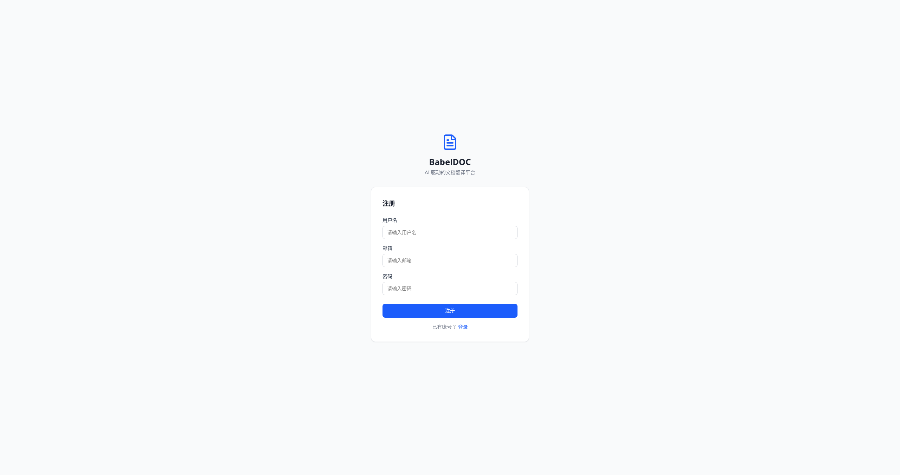
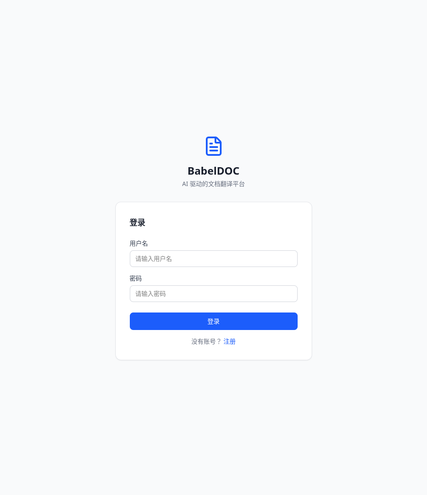
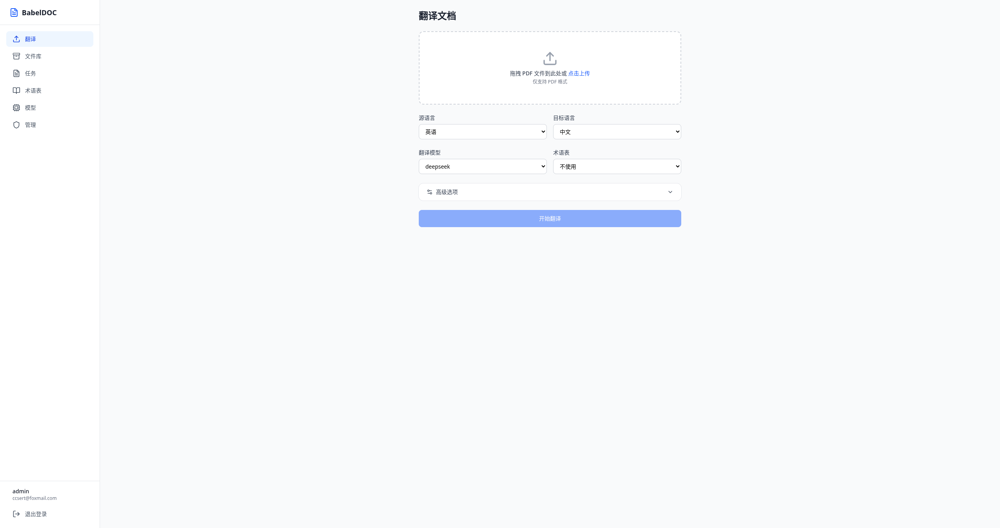
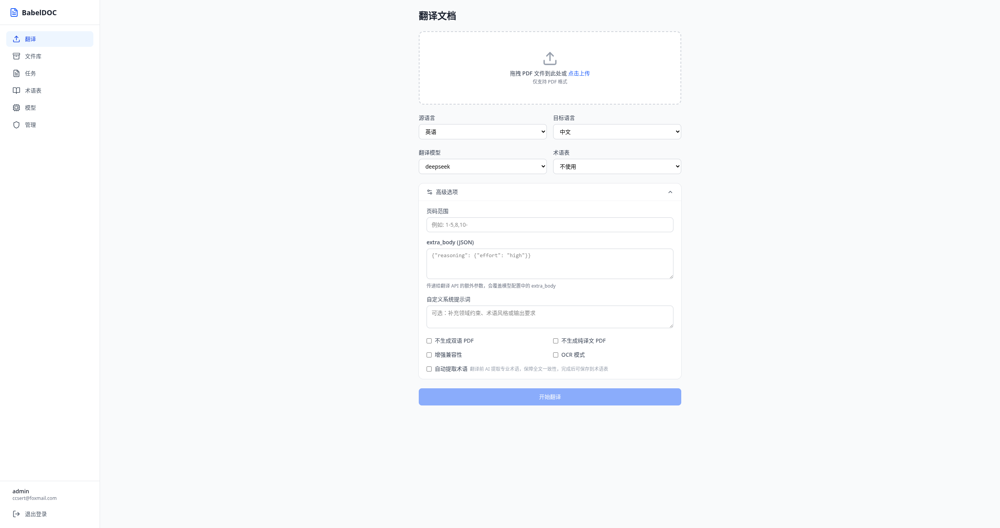
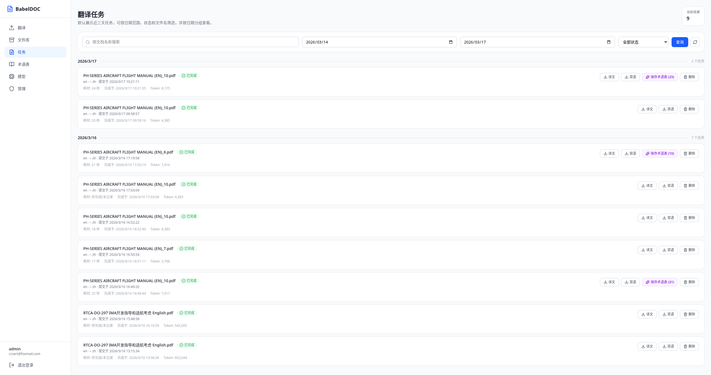
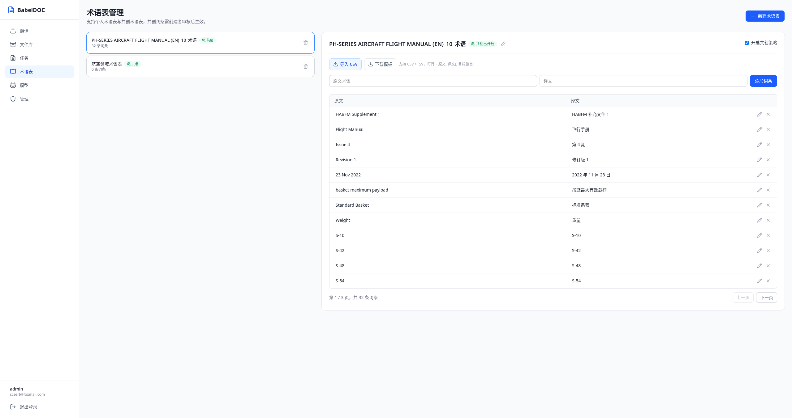
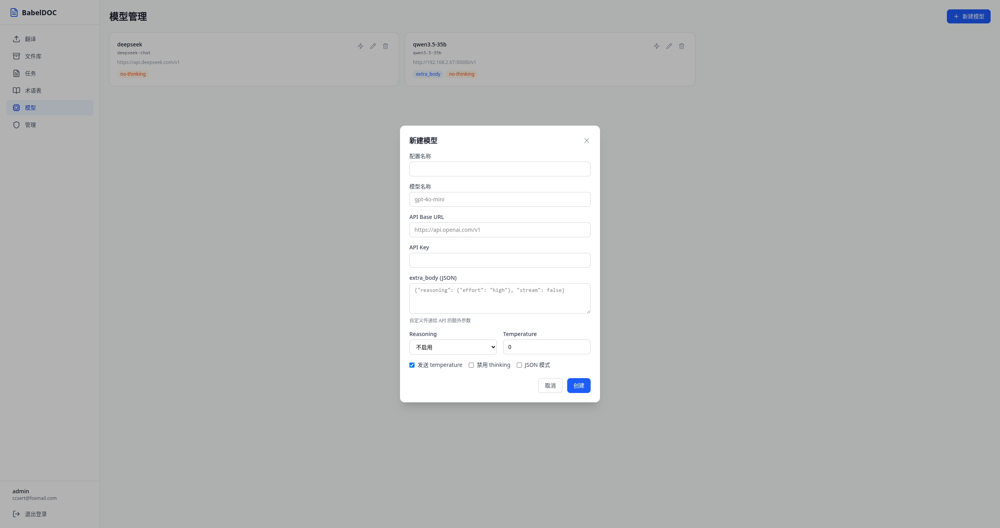
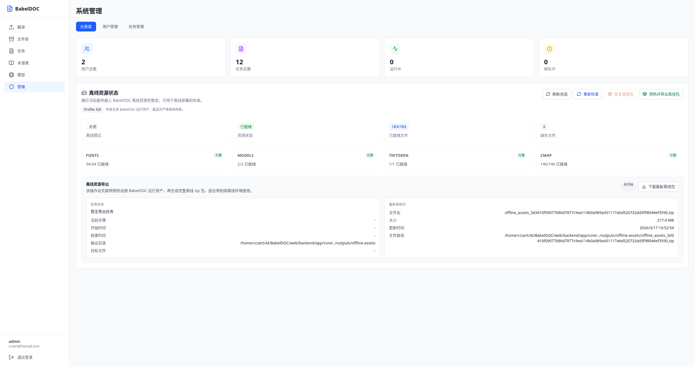
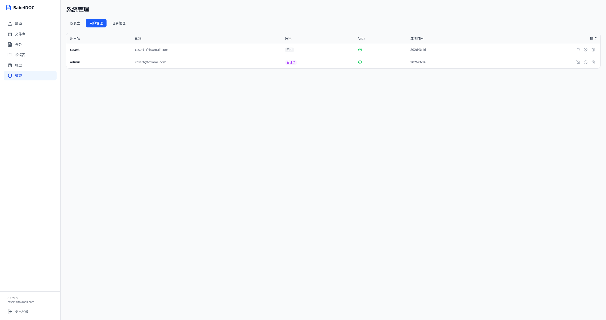
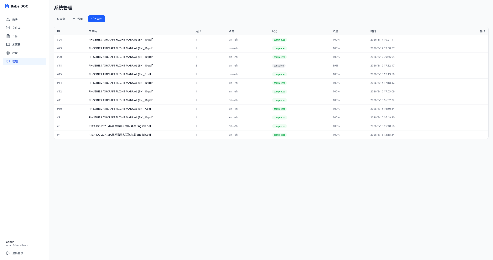

# BabelDOC Web — 用户操作手册

## 目录

- [1. 系统介绍](#1-系统介绍)
- [2. 账号管理](#2-账号管理)
  - [2.1 注册账号](#21-注册账号)
  - [2.2 登录系统](#22-登录系统)
  - [2.3 退出登录](#23-退出登录)
- [3. 文档翻译](#3-文档翻译)
  - [3.1 基本翻译流程](#31-基本翻译流程)
  - [3.2 高级选项](#32-高级选项)
  - [3.3 重复任务检测](#33-重复任务检测)
- [4. 任务管理](#4-任务管理)
  - [4.1 查看任务列表](#41-查看任务列表)
  - [4.2 下载翻译结果](#42-下载翻译结果)
  - [4.3 保存自动提取的术语](#43-保存自动提取的术语)
  - [4.4 取消与删除任务](#44-取消与删除任务)
- [5. 文件库](#5-文件库)
- [6. 术语表管理](#6-术语表管理)
  - [6.1 创建术语表](#61-创建术语表)
  - [6.2 管理术语条目](#62-管理术语条目)
  - [6.3 导入 CSV 术语](#63-导入-csv-术语)
  - [6.4 协作术语表](#64-协作术语表)
- [7. 模型管理（管理员）](#7-模型管理管理员)
  - [7.1 查看模型列表](#71-查看模型列表)
  - [7.2 创建模型](#72-创建模型)
  - [7.3 测试模型连接](#73-测试模型连接)
  - [7.4 编辑与删除模型](#74-编辑与删除模型)
- [8. 系统管理（管理员）](#8-系统管理管理员)
  - [8.1 仪表盘](#81-仪表盘)
  - [8.2 用户管理](#82-用户管理)
  - [8.3 任务管理](#83-任务管理)
  - [8.4 离线资源管理](#84-离线资源管理)

---

## 1. 系统介绍

BabelDOC Web 是一个 AI 驱动的 PDF 文档翻译平台。系统基于 BabelDOC 核心引擎，支持将 PDF 文档高质量地翻译为多种目标语言，同时保持原文档的排版格式。

**核心功能：**

- 上传 PDF 文档，选择源/目标语言，一键翻译
- 生成**纯译文 PDF** 和**双语对照 PDF** 两种输出
- 支持 11 种语言互翻：英语、中文、日语、韩语、法语、德语、西班牙语、葡萄牙语、俄语、阿拉伯语、意大利语
- 术语表管理与 AI 自动术语提取
- 多模型配置（兼容所有 OpenAI 格式 API）
- 管理员后台：用户管理、任务监控、离线资源管理

---

## 2. 账号管理

### 2.1 注册账号

> 注意：系统的**第一个注册用户**将自动成为管理员。后续注册的用户默认为普通用户。

访问注册页面，填写以下信息：

| 字段 | 说明 | 要求 |
|------|------|------|
| 用户名 | 登录使用的唯一标识 | 不可重复 |
| 邮箱 | 用户邮箱地址 | 合法邮箱格式，不可重复 |
| 密码 | 登录密码 | 建议 8 位以上 |



填写完成后点击「注册」按钮。注册成功后系统会自动跳转到登录页面。

### 2.2 登录系统

在登录页面输入用户名和密码，点击「登录」按钮：



登录成功后将跳转到翻译页面（系统首页）。

### 2.3 退出登录

在左侧导航栏底部可以看到当前登录用户信息，点击「退出登录」按钮即可安全退出。

---

## 3. 文档翻译

### 3.1 基本翻译流程

翻译页面是系统的核心功能入口：



**操作步骤：**

1. **上传文件** — 将 PDF 文件拖拽到虚线框区域，或点击「点击上传」选择文件（仅支持 PDF 格式）
2. **选择源语言** — 从下拉框中选择文档的原始语言（默认英语）
3. **选择目标语言** — 选择翻译的目标语言（默认中文）
4. **选择翻译模型** — 从管理员预配置的模型中选择一个（必选）
5. **选择术语表** — 可选择使用已创建的术语表，确保专业术语翻译一致性。选择「不使用」则不加载术语表
6. **开始翻译** — 点击「开始翻译」按钮，任务将被提交到翻译队列

**支持语言列表：**

| 语言代码 | 语言 | 语言代码 | 语言 |
|---------|------|---------|------|
| en | 英语 | pt | 葡萄牙语 |
| zh | 中文 | ru | 俄语 |
| ja | 日语 | ar | 阿拉伯语 |
| ko | 韩语 | it | 意大利语 |
| fr | 法语 | — | — |
| de | 德语 | — | — |
| es | 西班牙语 | — | — |

### 3.2 高级选项

点击「高级选项」展开更多翻译配置：



| 选项 | 说明 |
|------|------|
| **页码范围** | 指定翻译的页码范围，例如 `1-5,8,10-` 表示翻译第1-5页、第8页和第10页到最后。留空则翻译全文 |
| **extra_body (JSON)** | 传递给翻译 API 的额外参数，JSON 格式。例如 `{"reasoning": {"effort": "high"}}` 可提升推理质量。此参数会覆盖模型配置中的 extra_body |
| **自定义系统提示词** | 可选的补充提示词，用于约束翻译风格、领域术语或输出格式要求 |
| **不生成双语 PDF** | 勾选后将不生成双语对照版 PDF |
| **不生成纯译文 PDF** | 勾选后将不生成纯译文版 PDF |
| **增强兼容性** | 提升输出 PDF 在不同阅读器中的兼容性 |
| **OCR 模式** | 对扫描件或图片型 PDF 使用 OCR 识别后再翻译 |
| **自动提取术语** | 翻译前 AI 自动提取专业术语，翻译过程中保持全文术语一致性。翻译完成后可将提取的术语保存为术语表 |

### 3.3 重复任务检测

系统会自动检测是否已存在**相同文件 + 相同翻译配置**的已完成任务。如检测到重复，将弹出对话框提供以下选项：

- **取消** — 放弃本次提交
- **复用并下载** — 直接使用已有的翻译结果，无需等待
- **重新翻译** — 强制重新翻译（需变更部分配置参数）

---

## 4. 任务管理

### 4.1 查看任务列表

点击左侧导航栏「任务」进入任务管理页面：



**页面功能：**

- **日期筛选** — 默认显示近 3 天的任务，可调整开始/结束日期
- **状态筛选** — 下拉菜单过滤特定状态的任务（全部状态 / 等待中 / 排队中 / 运行中 / 已完成 / 失败 / 已取消）
- **搜索** — 按文件名关键词搜索任务
- **按日期分组** — 任务按提交日期分组展示，每组显示任务数量

**任务状态说明：**

| 状态 | 颜色 | 说明 |
|------|------|------|
| 等待中 (pending) | 灰色 | 任务已提交，等待入队 |
| 排队中 (queued) | 蓝色 | 已进入翻译队列，等待执行 |
| 运行中 (running) | 蓝色+进度条 | 正在翻译，显示实时进度百分比 |
| 已完成 (completed) | 绿色 | 翻译完成，可下载结果 |
| 失败 (failed) | 红色 | 翻译过程中出错 |
| 已取消 (cancelled) | 橙色 | 用户主动取消 |

**每个任务卡片显示的信息：**
- 文件名、语言对（如 en → zh）
- 提交时间、完成时间
- 耗时（秒）
- Token 消耗量
- 操作按钮（下载/取消/删除/保存术语）

**自动刷新机制：**
- 存在运行中/排队中的任务时，每 **3 秒** 自动刷新
- 无活跃任务时，每 **10 秒** 自动刷新

### 4.2 下载翻译结果

已完成的任务提供两种下载选项：

- **译文** — 下载纯译文版 PDF（仅包含翻译后的内容）
- **双语** — 下载双语对照版 PDF（原文与译文对照排列）

点击对应按钮即可开始下载。

### 4.3 保存自动提取的术语

如果翻译时启用了「自动提取术语」选项，已完成的任务会显示「保存术语表」按钮（如 `保存术语表(29)` 表示提取了 29 个术语对）。

点击后会弹出术语预览窗口，确认后将自动创建一个新的术语表，包含所有提取到的术语。

### 4.4 取消与删除任务

- **取消** — 对等待中/排队中/运行中的任务可点击「取消」按钮终止
- **删除** — 对已完成/失败/已取消的任务可点击「删除」按钮永久移除（包含关联的输出文件）

---

## 5. 文件库

点击左侧导航栏「文件库」查看所有已翻译完成的文档：


**页面功能：**

- **统计摘要** — 右上角显示已归档文件总数和累计翻译记录数
- **搜索** — 按文档名称搜索
- **日期筛选** — 按完成日期范围过滤
- **文件卡片** — 每个唯一文件显示为一张卡片，包含：
  - 文件名
  - 最近一次完成时间
  - 累计译文版本数（同一文件用不同配置翻译了多少次）
  - 最近一次翻译耗时
  - 下载按钮（译文 + 双语）

> 文件库按照文件内容哈希去重，即使上传了同名文件，只要内容相同就会归为同一组。

---

## 6. 术语表管理

点击左侧导航栏「术语表」进入术语管理页面：



### 6.1 创建术语表

1. 点击右上角「新建术语表」按钮
2. 输入术语表名称和可选的描述
3. 可选择是否开启「协作模式」（允许其他用户提交术语贡献）

### 6.2 管理术语条目

选中左侧术语表后，右侧面板显示术语详情：

**添加术语：**
1. 在「原文术语」和「译文」输入框中填写术语对
2. 点击「添加词条」按钮

**编辑术语：** 点击术语行右侧的编辑图标（✏️），修改后保存

**删除术语：** 点击术语行右侧的删除图标（✕）

**分页浏览：** 术语条目每页显示 12 条，使用底部的「上一页」「下一页」按钮翻页

### 6.3 导入 CSV 术语

支持通过 CSV/TSV 文件批量导入术语：

1. 点击「下载模板」获取 CSV 模板文件
2. 按模板格式填写术语数据（列: source, target, target_language）
3. 点击「导入 CSV」按钮选择文件上传

**CSV 格式示例：**

```csv
source,target,target_language
Flight Manual,飞行手册,zh
Standard Basket,标准吊篮,zh
Maximum Payload,最大有效载荷,zh
```

### 6.4 协作术语表

开启协作模式后：

- **术语表所有者** — 可直接添加/编辑/删除术语条目，可审核其他用户的贡献
- **其他用户** — 可提交术语贡献（pendng 状态），待所有者审核批准后生效

**审核流程：** 所有者在术语详情下方的「待审核贡献」区域可以看到所有 pending 状态的贡献，可选择：
- **批准** — 贡献转为正式术语条目
- **拒绝** — 标记为已拒绝（可附加审核备注）

---

## 7. 模型管理（管理员）

### 7.1 查看模型列表

点击左侧导航栏「模型」进入模型管理页面：


每个模型以卡片形式展示，包含：
- 配置名称和实际模型名称
- API Base URL
- 激活的功能标签（如 `extra_body`、`no-thinking`）

### 7.2 创建模型

> 仅管理员可以创建和管理模型配置。

点击右上角「新建模型」打开创建对话框：



**配置字段说明：**

| 字段 | 说明 | 示例 |
|------|------|------|
| **配置名称** | 显示给用户的名称，便于识别 | `deepseek` |
| **模型名称** | API 调用时的 model 参数 | `deepseek-chat`、`gpt-4o-mini` |
| **API Base URL** | 模型服务的 API 地址 | `https://api.deepseek.com/v1` |
| **API Key** | 访问密钥 | `sk-...` |
| **extra_body (JSON)** | 传递给 API 的额外参数 | `{"stream": false}` |
| **Reasoning** | 推理强度级别 | 不启用 / minimal / low / medium / high |
| **Temperature** | 采样温度，越低越确定性 | `0`（推荐翻译使用低值） |
| **发送 temperature** | 是否在请求中包含 temperature 参数 | 默认勾选 |
| **禁用 thinking** | 禁用模型的 thinking/推理输出 | 某些模型需要 |
| **JSON 模式** | 强制模型以 JSON 格式输出 | 一般不需要 |

### 7.3 测试模型连接

点击模型卡片上的钻石图标（测试连接）可以发送一条测试翻译请求到模型 API：

- **成功** — 显示翻译结果和 Token 消耗
- **失败** — 显示错误信息，帮助排查配置问题

### 7.4 编辑与删除模型

- **编辑** — 点击钢笔图标，在弹窗中修改模型配置。API Key 字段不编辑则保持原值
- **删除** — 点击垃圾桶图标，确认后永久删除模型配置

> 注意：已被翻译任务引用的模型删除后不影响历史任务记录。

---

## 8. 系统管理（管理员）

### 8.1 仪表盘

点击左侧导航栏「管理」进入系统管理页面，默认显示仪表盘：



**统计卡片：**
- **用户总数** — 系统注册用户数量
- **任务总数** — 所有翻译任务累计数量
- **运行中** — 当前正在执行的翻译任务数
- **排队中** — 等待执行的翻译任务数

### 8.2 用户管理

切换到「用户管理」标签页：



**用户表格字段：**
- 用户名、邮箱、角色（管理员/用户）、状态（绿色圆点=活跃）、注册时间

**可执行操作：**

| 操作 | 说明 |
|------|------|
| 升为管理员 / 降为用户 | 切换用户角色 |
| 禁用用户 / 启用用户 | 切换用户活跃状态，禁用后无法登录 |
| 删除用户 | 永久删除用户及其所有数据 |

> 安全机制：系统至少保留 1 个活跃管理员，不可删除或禁用最后一个管理员。

### 8.3 任务管理

切换到「任务管理」标签页，查看所有用户的翻译任务：



管理员可以看到所有用户的任务列表，包含：
- 任务 ID、文件名、所属用户 ID、语言对、状态、进度、提交时间
- 对运行中的任务可以执行取消操作

### 8.4 离线资源管理

在仪表盘页面下方有「离线资源状态」面板（详见截图中的管理仪表盘），提供以下功能：

**资源状态概览：**
- **离线模式** — 当前是否启用离线模式（开/关）
- **资源状态** — 所有必需资源是否就绪
- **已就绪文件** — 就绪文件数 / 总需要文件数
- **缺失文件** — 缺少的资源文件数量

**分类资源详情：**

| 资源类别 | 说明 |
|---------|------|
| **Fonts** | BabelDOC 排版所需的字体文件 |
| **Models** | AI 模型相关文件 |
| **Tiktoken** | Token 编码器数据 |
| **CMap** | PDF CMap 字符映射表 |

**管理操作：**

| 按钮 | 说明 |
|------|------|
| **刷新状态** | 重新获取当前资源状态 |
| **重新检查** | 触发后端重新扫描资源目录 |
| **恢复离线包** | 从预配置的离线包路径中恢复资源（需配置 `BABELDOC_OFFLINE_ASSETS_PACKAGE`） |
| **预热并导出离线包** | 联网下载全部资源并打包为 ZIP，供离线环境使用 |
| **下载最新离线包** | 下载已导出的离线资源 ZIP 包 |

**离线部署流程：**

1. 在**联网环境**点击「预热并导出离线包」，等待资源下载和打包完成
2. 下载生成的 ZIP 离线包
3. 将 ZIP 包拷贝到**离线目标环境**
4. 配置环境变量 `BABELDOC_OFFLINE_ASSETS_PACKAGE` 指向离线包路径
5. 启动服务或点击「恢复离线包」自动解压

---

## 附录 A：快捷键与技巧

| 技巧 | 说明 |
|------|------|
| 拖拽上传 | 直接将 PDF 文件拖到翻译页面即可上传 |
| 页码范围语法 | `1-5` 第1-5页；`8` 第8页；`10-` 第10页到末尾；用逗号分隔组合 |
| extra_body | 支持任意 JSON，用于传递特定 API 参数 |
| 术语表 CSV | 支持 CSV 和 TSV 两种格式导入 |

## 附录 B：常见问题

**Q: 为什么「开始翻译」按钮是灰色不可点击？**
A: 需要先上传 PDF 文件，按钮才会变为可点击状态。

**Q: 翻译失败怎么办？**
A: 查看任务详情中的错误信息。常见原因包括：模型 API Key 过期、API 服务不可用、文件格式问题等。

**Q: 如何翻译扫描件 PDF？**
A: 在高级选项中勾选「OCR 模式」，系统会先进行文字识别再翻译。

**Q: 术语表一致性如何保证？**
A: 选择术语表后，BabelDOC 会在翻译过程中自动匹配并使用术语表中的翻译。启用「自动提取术语」可以进一步增强术语一致性。

**Q: 可以同时翻译多个文件吗？**
A: 目前每次只能上传一个文件。可以依次提交多个翻译任务，系统会自动排队处理。
